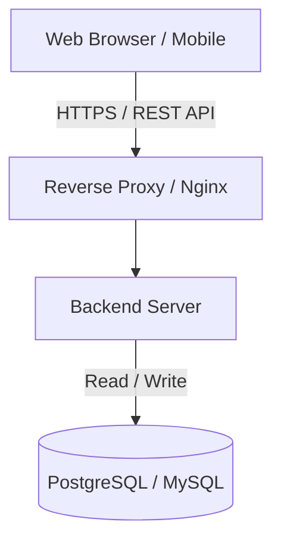
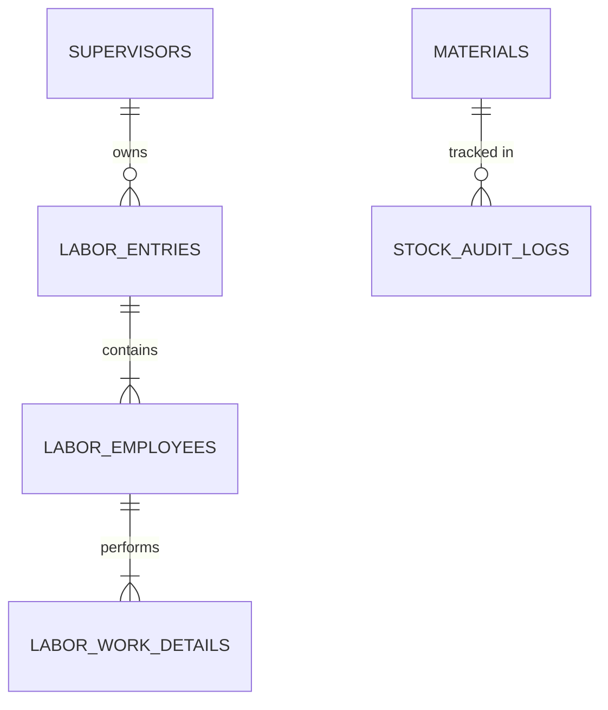

# Pramukh Scrap Management System (PSMS)
## Software Requirement Specification & Product Documentation

---

## 📖 Executive Summary

The **Pramukh Scrap Management System (PSMS)** is a comprehensive, enterprise-grade Web Application designed to streamline, track, and optimize daily operations within the scrap management industry. Acting as the digital backbone of the business, PSMS facilitates the real-time management of daily labor output across multiple work types, maintains strict control over raw material inventory, and provides management with deep, actionable business analytics through a dynamic dashboard.

This document serves as the complete **Software Requirement Specification (SRS)**, **Business Requirement Document (BRD)**, and **Developer Guide**, ensuring all stakeholders (business sponsors, project managers, frontend/backend developers, and QA engineers) have a single source of truth.

---

## 🎯 Project Scope

The project encapsulates the end-to-end digitization of the Pramukh Scrap facility's core operations. It focuses on replacing manual, paper-based tracking of labor efforts and stock inventory with a robust, cloud-ready web application. 

### In-Scope:
1. **Dashboard & Analytics:** Real-time visibility into labor costs, employee productivity, and inventory valuation.
2. **Labor Management:** Tracking daily labor efforts categorized by supervisors, including granular multi-select work types (Grinding, Kabadu, Patakadku), dynamic calculations of rates, total weights, deductions, and final payable amounts.
3. **Stock Management:** Complete lifecycle management of raw materials, including real-time stock status, manual adjustments (Add/Remove), and rigorous audit logging of every transaction.

### Out-of-Scope (Phase 1):
1. **Payroll Integration:** Direct integration with banking APIs or external HR payroll systems is excluded.
2. **Hardware Integration:** Integration with IoT weight scales or barcode scanners is deferred to future phases.
3. **Customer Invoicing/Sales:** The current scope focuses strictly on inbound labor and stock tracking, not the outbound sale of processed scrap.

---

## 🚀 Objectives and Business Goals

### Primary Objectives
- **Digitize Operations:** Eliminate manual logbooks and spreadsheet dependency within 30 days of launch.
- **Accurate Financial Tracking:** Reduce errors in labor cost calculations to 0% by automating Weight × Rate formulas and deductions.
- **Inventory Control:** Ensure 100% accuracy in stock tracking with mandatory audit trails for every Add/Remove action.

### Business Goals
- **Cost Optimization:** Identify high-cost labor days and optimize supervisor allocations through the Dashboard's analytics.
- **Stock Optimization:** Prevent stock-outs or over-purchasing by utilizing real-time "Low Stock Alerts" and Stock Value metrics.
- **Operational Transparency:** Provide business owners (Admins) with immediate, anytime-access to business performance via secure web access.

---

## 📖 Glossary of Terms

| Term | Definition |
| :--- | :--- |
| **Grinding** | A specific scrap processing work type involving the physical grinding of materials. |
| **Kabadu** | A specific scrap processing work type related to sorting/breaking down rough scrap. |
| **Patakadku** | A specific scrap processing work type related to flattening or specific metal preparation. |
| **Payable Amount** | The final monetary figure owed to a labor group, calculated as: `(Total Amount - Deductions)`. |
| **Stock Value** | The financial valuation of a specific material in inventory, calculated as: `(Current Stock Quantity × Average Rate)`. |
| **KPI** | Key Performance Indicator. |

===========================================================

# GENERAL REQUIREMENTS

## ⚙️ Functional Requirements

### FR-02: Dashboard
- **FR-02.1:** The system shall aggregate and display real-time KPIs regarding labor, costs, and stock.
- **FR-02.2:** The system shall provide graphical representations of data.

### FR-03: Labor Management
- **FR-03.1:** The system shall allow the creation of daily labor records associated with a specific Supervisor.
- **FR-03.2:** The system shall support dynamic, multi-select work types (Grinding, Kabadu, Patakadku) per employee.
- **FR-03.3:** The system shall automatically calculate the Amount for each work type based on Weight and Rate.
- **FR-03.4:** The system shall calculate Total Amount, apply Deductions, and output a Final Payable Amount.

### FR-04: Stock Management
- **FR-04.1:** The system shall maintain a master list of all raw materials.
- **FR-04.2:** The system shall automatically calculate Stock Value based on Current Stock Quantity × Rate.
- **FR-04.3:** The system shall mandate an Add/Remove workflow for adjusting stock.
- **FR-04.4:** The system shall generate an immutable Audit Log for every stock transaction.

---

## 🛡️ Non-Functional Requirements (NFRs)

### NFR-01: Security
- **Data in Transit:** All traffic must be encrypted using TLS 1.2 or higher (HTTPS).
- **SQL Injection/XSS:** The system must use parameterized queries/ORMs and sanitize all user inputs.

### NFR-02: Performance Optimization
- **Page Load:** The Dashboard and List screens must load in under 2.0 seconds.
- **Database Indexing:** Frequently searched columns (Date, Supervisor Name, Material Name) must be indexed.
- **Pagination:** All list views must utilize server-side pagination.

### NFR-03: Usability
- **Responsive Design:** The web application must be fully responsive (mobile is crucial for Supervisors).
- **Error Messages:** System errors must be user-friendly and actionable.

---

## 📌 Assumptions, Dependencies, and Constraints

### Assumptions
1. Supervisors will have access to mobile devices or tablets with an internet connection to log entries.
2. Rates for work types and stock can fluctuate daily; historical records must retain the rate applied at the time of creation.

### Dependencies
1. **Hosting Environment:** Requires a cloud provider (AWS, Azure, Vercel).
2. **Database:** Requires a robust Relational Database (PostgreSQL or MySQL).
3. **Export Libraries:** Reliance on external libraries (`xlsx`, `pdfmake`) for generating Excel/PDF reports.

### Constraints
1. **Browser Compatibility:** Must support the latest versions of Chrome, Safari, Firefox, and Edge.
2. **Offline Mode:** The system currently does not support offline data entry.

===========================================================

# SYSTEM ARCHITECTURE AND DESIGN

## 🏗️ Application Architecture

The system follows a standard **Modern Client-Server (Three-Tier) Architecture**:

1. **Presentation Layer:** SPA built with React.js, Next.js, or Vue.js.
2. **Business Logic Layer:** RESTful API built on Node.js (Express/NestJS).
3. **Data Access Layer:** PostgreSQL or MySQL database.



## 🛠️ Technology Stack (Recommended)

- **Frontend:** React.js (via Vite) or Next.js
- **Styling:** Tailwind CSS / Material UI
- **Backend:** Node.js with Express / NestJS
- **Database:** PostgreSQL
- **ORM:** Prisma ORM or TypeORM

## 📂 Folder Structure (Recommended)

### Frontend
```text
/src
 ├── /components      # Reusable UI components
 ├── /context         # React Context API
 ├── /pages           # Route components (Dashboard, LaborList)
 ├── /services        # API integration layer
 └── /utils           # Helper functions
```

### Backend
```text
/src
 ├── /config          # Environment variables, DB connection config
 ├── /controllers     # Request handlers
 ├── /middlewares     # Auth validation, Error handling
 ├── /models          # ORM schemas
 ├── /routes          # API route definitions
 └── /services        # Core business logic
```

## 🚨 Error Handling and Validation
- **Frontend Validations:** Implement Client-Side Validation (e.g., Formik + Yup) to provide immediate feedback.
- **Backend Validations:** Never trust client data. Re-validate all rules before interacting with the database.

## 📝 Logging, Audit Trail, and Notifications
- **Audit Trail:** Every addition or removal of stock must create a discrete, immutable record in an `AuditLogs` table.
- **Notification System:** A lightweight UI notification system (e.g., `react-toastify`).

===========================================================

# MODULE 1: DASHBOARD

The Dashboard acts as the central command center for tracking business performance.

## 📊 Key Performance Indicators (KPIs) & Dashboard Cards

| KPI Card Name | Description | Calculation Logic |
| :--- | :--- | :--- |
| **Total Labor Today** | Count of distinct labor entries logged today. | `COUNT(labor_entries) WHERE date = TODAY` |
| **Total Supervisors** | Active supervisors deployed today. | `COUNT(DISTINCT supervisor_id) WHERE date = TODAY` |
| **Total Employees** | Total individual laborers present today. | `SUM(employee_count) WHERE date = TODAY` |
| **Total Labor Cost Today**| Financial liability incurred today. | `SUM(payable_amount) WHERE date = TODAY` |
| **Monthly Labor Cost** | Rolling or calendar month labor liability. | `SUM(payable_amount) WHERE date >= START_OF_MONTH` |
| **Total Available Stock** | Physical quantity of all materials. | `SUM(current_stock)` |
| **Total Stock Value** | Total financial asset value in the yard. | `SUM(stock_value)` |

## 📈 Data Visualizations & Chart Suggestions

1. **Monthly Expense Graph (Bar Chart):** Compares total labor payout month-over-month.
2. **Labor Cost Graph (Line Chart):** Highlights daily volatility in labor expenses.
3. **Stock Value Chart (Donut / Pie Chart):** Shows portfolio distribution based on material values.
4. **Weekly Labor Trend (Area Chart):** Analyzes workforce stability.
5. **Material Usage Trend (Stacked Bar Chart):** Tracks velocity of material movement (Add vs. Remove).

## 📋 Data Grids & Lists

1. **Low Stock Alerts:** Highlights materials where `Current Stock <= Threshold`.
2. **Recent Labor Entries:** Feed of the 5 most recently submitted labor sheets.
3. **Recent Stock Updates:** Audit trail feed showing the latest inventory movements.

## 🏆 Leaderboards
- **Top Working Supervisors:** Ranks supervisors by highest Total Weight processed.
- **Most Used Material:** Identifies the fastest-moving inventory item.

## ⚡ Quick Action Buttons
- `[ + Add Labor Entry ]`
- `[ + Update Stock ]`
- `[ Export Daily Report (PDF) ]`

## 🎛️ Filtering Options
- **Date Range Picker:** Toggle between Today, Yesterday, This Week, This Month.
- **Supervisor Filter:** Isolate labor data to a single supervisor.
- **Material Filter:** Isolate stock charts to a specific scrap category.

===========================================================

# MODULE 2: LABOR MANAGEMENT

This module handles the highly dynamic, daily data entry for labor crews overseen by Supervisors.

## 1. Labor List Screen

### Columns
| Column Name | Data Type | Example | Description |
| :--- | :--- | :--- | :--- |
| **Date** | Date | `25-Oct-2023` | Date of the labor entry. |
| **Supervisor Name** | String | `Ramesh Patel` | Name of the supervisor in charge. |
| **Work Type Summary** | String | `Grinding, Kabadu` | Preview of work types involved. |
| **Total Weight** | Number | `25.5 kg` | Aggregated weight for the entry. |
| **Total Amount** | Currency | `2500.00` | Aggregated gross amount. |
| **Action** | Buttons | `View`, `Edit`, `Delete` | Context menu actions. |

### Features
- Global Search, Filters (Date Range, Supervisor), Export to Excel/PDF, and `[+ Add Labor]` Button.

## 2. Add Labor Screen

### Top Section
| Field Name | UI Type | Required | Example | Description |
| :--- | :--- | :---: | :--- | :--- |
| **Date** | Date Picker | Yes | `25-Oct-2023` | Select date of labor output. Defaults to today. |
| **Supervisor** | Dropdown | Yes | `Ramesh Patel` | Select from active supervisors. |

### Employee Details Section (Dynamic)
An expandable section containing an `[+ Add Employee]` button.

**Inside each Employee Block:**

| Field Name | UI Type | Required | Example | Description |
| :--- | :--- | :---: | :--- | :--- |
| **Employee Name** | Text Input | Yes | `Suresh` | Name of the daily laborer. |
| **Work Type** | Multi-Select | Yes | `Grinding, Kabadu` | Options: `Grinding`, `Kabadu`, `Patakadku`. |

**Dynamic Fields based on Work Type Selection:**
*If a specific work type is selected, the following fields appear for that type:*

| Field Name | UI Type | Required | Example | Description |
| :--- | :--- | :---: | :--- | :--- |
| **[Type] Weight** | Number Input | Yes | `10.5` | Weight processed (e.g., Grinding Weight). |
| **[Type] Rate** | Number Input | Yes | `50.00` | Rate applied (e.g., Grinding Rate). |
| **[Type] Amount** | Read-Only | Auto | `525.00` | Auto-calculates as `Weight × Rate`. |

## 3. Calculation Section (Bottom)

| Field Name | UI Type | Required | Example | Description |
| :--- | :--- | :---: | :--- | :--- |
| **Category Totals** | Read-Only | Auto | `1000.00` | Sums for Grinding, Kabadu, and Patakadku individually. |
| **Grand Total** | Read-Only | Auto | `2500.00` | Sum of all category totals combined. |
| **Deduction** | Number Input | No | `500.00` | User input for advance payments or penalties. |
| **Payable Amount** | Read-Only | Auto | `2000.00` | Final payable calculation (`Grand Total - Deduction`). |

## 4. Edit & View Labor Screens

### Edit Labor Screen
Mirrors the exact UI of the Add screen but pre-populated with existing data.

| Field Name | UI Type | Description |
| :--- | :--- | :--- |
| **(All Add Labor Fields)**| Various | All fields from the Add Labor screen are available here for modification. |

*Edge case:* If a work type is deselected during edit, data is lost on save.

### View Labor Screen
A highly polished, read-only invoice-style printable view.

| Section | UI Type | Description |
| :--- | :--- | :--- |
| **Header Details** | Read-Only Text | Displays Supervisor Details and Date. |
| **Employee Table** | Data Grid | Displays each employee, their Work Types, Weight, Rate, and Amount. |
| **Footer Totals** | Read-Only Text | Category Totals, Grand Total, Deduction, and Final Payable Amount. |

===========================================================

# MODULE 3: STOCK MANAGEMENT

Ensures strict governance over the facility's physical raw material inventory.

## 1. Stock List Screen

### Columns
| Column Name | Data Type | Example | Description |
| :--- | :--- | :--- | :--- |
| **Material Name** | String | `Copper Wire` | The name of the scrap material. |
| **Current Stock** | Number | `450.5 kg` | The physical quantity available. |
| **Stock Value** | Currency | `54060.00` | The total financial valuation. |
| **Stock Status** | Visual Badge | `Low Stock` | Indicator (e.g., Healthy, Low, Depleted). |
| **Actions** | Buttons | `View`, `Edit` | Context menu actions. |
- **Features:** Search, Filters, Export, Pagination.

## 2. Add Stock (New Material Creation)
Used to onboard a new type of material.

| Field Name | UI Type | Required | Example | Description |
| :--- | :--- | :---: | :--- | :--- |
| **Material Name** | Text Input | Yes | `Aluminum Pipes` | Name of the scrap material. |
| **Description** | Text Area | No | `A-grade pipes` | Optional details about the material. |
| **Quantity** | Number Input | Yes | `500.5` | Initial physical stock level. |
| **Rate** | Number Input | Yes | `110.00` | Average purchasing rate. |
| **Stock Date** | Date Picker | Yes | `25-Oct-2023` | Date the stock was recorded. |
| **Material Image** | File Upload | No | `image.png` | Photo of the material type. |

**Formula:** `Stock Value = Quantity × Rate`

## 3. Edit Stock (Stock Adjustment Workflow)

> [!WARNING]  
> `Current Stock` is strictly **Read-Only**. Users must explicitly declare an "Add" or "Remove" action.

**If Add Stock or Remove Stock Selected:**

| Field Name | UI Type | Required | Example | Description |
| :--- | :--- | :---: | :--- | :--- |
| **Action Type** | Button/Radio | Yes | `Add Stock` | Choose Add (Inbound) or Remove (Outbound). |
| **Quantity** | Number Input | Yes | `50` | Adjustment quantity. |
| **Rate** | Number Input | Yes | `120.00` | Rate applied for this adjustment. |
| **Remarks** | Text Input | Yes | `Refill` | Mandatory reason for adjustment. |
| **Amount** | Read-Only | Auto | `6000.00` | Auto-calculates as `Quantity × Rate`. |

**System Calculations:**
- **Add Stock:** `New Current Stock = Existing Stock + Qty`
- **Remove Stock:** `New Current Stock = Existing Stock - Qty`

## 4. View Stock (Audit Log & History)

Displays material profile and a chronological ledger of all adjustments.

**Material Profile Display Fields (Upper Section):**
| Field Name | UI Type | Description |
| :--- | :--- | :--- |
| **Material Image** | Image Thumbnail | Visual representation of the scrap material. |
| **Material Name** | Read-Only Text | Name of the material. |
| **Description** | Read-Only Text | Details about the material. |
| **Current Stock** | Read-Only Number | The total quantity currently on hand. |
| **Rate** | Read-Only Currency | The average purchasing rate. |
| **Stock Value** | Read-Only Currency | Total valuation (`Current Stock × Rate`). |
| **Created Date** | Read-Only Date | Date the material was originally added. |
| **Last Updated** | Read-Only Date | Timestamp of the most recent adjustment. |

**Audit Log Table Fields (Lower Section):**
| Column Name | Data Format | Example | Description |
| :--- | :--- | :--- | :--- |
| **Date & Time** | Timestamp | `25-Oct-23 10:00 AM`| When the adjustment occurred. |
| **Action** | Badge | `ADDED` | Visual badge for Add or Remove. |
| **Quantity** | Number | `50.0 kg` | The adjusted quantity. |
| **Rate Applied**| Currency | `120.00` | Rate applied at the time. |
| **Amount** | Currency | `6000.00` | Financial impact of adjustment. |
| **Remarks** | Text | `Furnace melting` | Reason provided for the change. |

===========================================================

# DATABASE DESIGN

## 🗺️ Entity Relationship Diagram



## 🗄️ Database Tables

### 1. `LaborEntries`
| Field Name | Data Type | Constraints | Example | Description |
| :--- | :--- | :--- | :--- | :--- |
| `id` | UUID | Primary Key | `550e8400-e29b-41d4-a716-446655440000` | Unique identifier for the entry. |
| `date` | DATE | Not Null | `2023-10-25` | Date of the labor record. |
| `supervisor_id` | UUID | Foreign Key | `a1b2c3d4-...` | Reference to the Supervisor. |
| `deduction` | DECIMAL(10,2) | Default 0.00 | `500.00` | Advance or penalty subtracted. |
| `grand_total` | DECIMAL(10,2) | Not Null | `2500.00` | Sum of all work amounts before deductions. |
| `payable_amount` | DECIMAL(10,2) | Not Null | `2000.00` | Final amount payable (`grand_total - deduction`). |

### 2. `LaborEmployees`
| Field Name | Data Type | Constraints | Example | Description |
| :--- | :--- | :--- | :--- | :--- |
| `id` | UUID | Primary Key | `f47ac10b-...` | Unique identifier for the employee entry. |
| `labor_entry_id`| UUID | Foreign Key | `550e8400-...` | Link to the parent `LaborEntries` record. |
| `employee_name` | VARCHAR(100) | Not Null | `Ramesh Kumar` | Full name of the daily wage laborer. |

### 3. `LaborWorkDetails`
| Field Name | Data Type | Constraints | Example | Description |
| :--- | :--- | :--- | :--- | :--- |
| `id` | UUID | Primary Key | `83b2...` | Unique identifier for the work detail. |
| `labor_employee_id`| UUID | Foreign Key | `f47ac10b-...` | Link to the parent `LaborEmployees` record. |
| `work_type` | ENUM | Not Null | `Grinding` | Type of work: `Grinding`, `Kabadu`, `Patakadku`. |
| `weight` | DECIMAL(10,3) | Not Null | `10.500` | Weight of processed scrap in Kg/Tons. |
| `rate` | DECIMAL(10,2) | Not Null | `100.00` | Financial rate applied per unit of weight. |
| `amount` | DECIMAL(10,2) | Not Null | `1050.00` | Calculated as `weight * rate`. |

### 4. `Materials`
| Field Name | Data Type | Constraints | Example | Description |
| :--- | :--- | :--- | :--- | :--- |
| `id` | UUID | Primary Key | `c92d...` | Unique identifier for the material. |
| `name` | VARCHAR(100) | Unique, Not Null | `Copper Wire` | Name of the scrap material. |
| `current_stock` | DECIMAL(12,3) | Default 0.000 | `450.500` | Physical quantity currently in yard. |
| `average_rate` | DECIMAL(10,2) | Default 0.00 | `120.00` | Computed average purchasing rate. |
| `stock_value` | DECIMAL(15,2) | Default 0.00 | `54060.00` | Calculated as `current_stock * average_rate`. |

### 5. `StockAuditLogs`
| Field Name | Data Type | Constraints | Example | Description |
| :--- | :--- | :--- | :--- | :--- |
| `id` | UUID | Primary Key | `b18c...` | Unique identifier for the audit log. |
| `material_id` | UUID | Foreign Key | `c92d...` | Link to the parent `Materials` record. |
| `action_type` | ENUM | Not Null | `ADD` | Type of adjustment: `ADD` or `REMOVE`. |
| `quantity` | DECIMAL(12,3) | Not Null | `50.000` | Adjustment amount. |
| `rate` | DECIMAL(10,2) | Not Null | `125.00` | Rate applied during this specific adjustment. |
| `amount` | DECIMAL(15,2) | Not Null | `6250.00` | Financial amount of adjustment (`quantity * rate`). |
| `snapshot_current_stock`| DECIMAL(12,3) | Not Null | `500.500` | Total stock level *after* this adjustment. |
| `remarks` | TEXT | Not Null | `Received from vendor ABC.`| Mandatory reason/comment for the adjustment. |

===========================================================

# API SPECIFICATIONS

- **Base URL:** `/api/v1`

## 1. Labor Management APIs
- `POST /api/v1/labors` - Create a labor entry.
  *Payload must include nested employee and work details arrays.*
  *Validation:* `payableAmount` MUST exactly equal `sum(amounts) - deduction`.

## 2. Stock Management APIs
- `POST /api/v1/stocks/:materialId/adjust` - Add or Remove stock.
  *Payload:* `actionType`, `quantity`, `rate`, `remarks`.
  *Validation:* `quantity` must be > 0. If `actionType === 'REMOVE'`, quantity cannot exceed current stock.

===========================================================

# TESTING AND ACCEPTANCE

## 🧪 Testing Strategy
1. **Unit Testing:** Validate `weight * rate` math rounding to 2 decimal places.
2. **Integration Testing:** Verify stock `REMOVE` call decreases `Materials` table and inserts to `StockAuditLogs`.

## ✔️ Acceptance Criteria
1. **Labor Precision:** A mixed 10-employee labor sheet perfectly matches a manual calculation for Payable Amount.
2. **Audit Integrity:** Impossible to change material stock levels without a logged remark.
